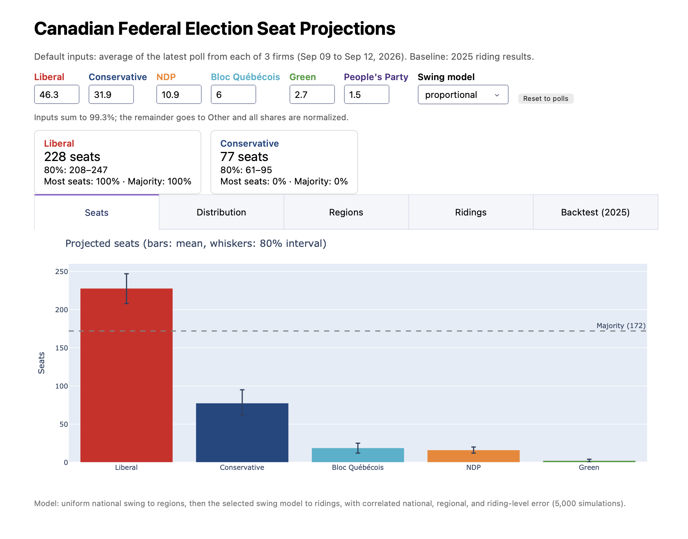

# Canadian Federal Election Seat Projections

A riding-level Monte Carlo model that turns polls into seat projections for all 343 federal
ridings under first-past-the-post, with an interactive Dash dashboard and an out-of-sample
backtest against the 2025 election.

> Python · NumPy · pandas · Plotly · Dash · pytest · GitHub Actions



## Backtest: how well would it have predicted 2025?

The model was given only what was known before election day: the 2021 results (transposed onto
the 2025 riding map) and the final-week national polls. Its projections were then scored against
the actual 2025 results. Full report: [`reports/backtest_2025.md`](reports/backtest_2025.md).

| | Ridings called correctly | Ridings that changed hands, called correctly |
|---|---|---|
| Naive baseline: every riding re-elects its 2021 winner | 83.1% | 0 of 58 |
| This model, proportional swing (default) | 86.0% | 26 of 58 |
| This model, uniform swing | 87.5% | 25 of 58 |

**What the backtest revealed:**

- **The model was overconfident.** It gave the Liberals a 94.6% chance of a majority; they won
  169 seats, short of the 172 needed. The actual Liberal total fell at the 3rd percentile of the
  simulated distribution, and ridings the model called with 80–90% confidence were won only 68%
  of the time.
- **The error is concentrated in Ontario.** The model over-projected the Liberals by 14 Ontario
  seats. Even when fed the *actual* 2025 Ontario vote shares, it still over-projected them by 10.
  So the problem is not the polls: Ontario ridings did not swing uniformly. Most of the missed
  Ontario ridings fall into two groups the model projected Liberal but the Conservatives won:
  GTA suburbs (Markham–Unionville, Vaughan–Woodbridge, Richmond Hill South, Newmarket–Aurora) and
  industrial or northern ridings where the NDP had been strong (both Windsor ridings, Hamilton
  East–Stoney Creek, Sudbury East). In the second group, the collapsing NDP vote appears to have
  gone to the Conservatives rather than being shared out in proportion. This suggests ridings within each group
  moved together, which a model with only regional and independent riding-level error cannot
  represent.
- **Wider error bands would have been better calibrated.** Doubling the noise improves the Brier
  score from 0.199 to 0.187. The defaults were deliberately *not* re-tuned on this result, since
  tuning on one election would overfit; see [Next steps](#limitations-and-next-steps).

## How it works

1. **Baseline.** Start from each riding's vote shares in the previous election.
2. **National → regional.** Spread the national poll average across seven regions (Atlantic,
   Quebec, Ontario, Sask. & Man., Alberta, B.C., territories) with uniform national swing. A party
   that only runs in some regions has its change concentrated there, so a 1-point national Bloc
   gain becomes roughly a 4-point gain in Quebec.
3. **Regional → riding.** Apply the regional change to each riding with a swing model:
   *proportional* (every riding scaled by the same ratio, as CBC's Poll Tracker does), *uniform*
   (every riding moves by the same number of points), or *hybrid* (their average).
4. **First past the post.** The party with the most votes in a riding wins it.
5. **Uncertainty.** Each of 10,000 simulations draws three layers of error: a national polling
   error per party shared by every riding, a regional error shared within each region, and an
   independent riding-level error. The shared layers matter most. Without them, errors average
   out over 343 ridings and the model becomes wildly overconfident.

The simulation is fully vectorized with NumPy: 10,000 simulations of 343 ridings take about
2 seconds.

## Quickstart

```bash
git clone https://github.com/aminbhv/canadian-election-projections.git
cd canadian-election-projections
python3 -m venv .venv && source .venv/bin/activate   # Windows: .venv\Scripts\activate
pip install -r requirements-dev.txt

python dashboard.py                 # dashboard at http://127.0.0.1:8050
python -m election.projection       # current projection from the latest polls, in the terminal
python -m election.backtest         # re-run the 2025 backtest; writes reports/
pytest                              # run the test suite
```

Requires Python 3.10+.

## Dashboard

- **What-if inputs:** set each party's national vote share (defaults to the latest poll average)
  and choose the swing model; the projection re-runs 5,000 simulations.
- **Seats:** mean projection with 80% intervals and the majority line.
- **Distribution:** full simulated seat distribution for the two largest parties.
- **Regions:** map of the projected seat leader by region.
- **Ridings:** searchable, sortable table of all 343 ridings with win probabilities; ridings
  projected to change hands are highlighted.
- **Backtest:** the 2025 backtest report.

## Project structure

```
├── dashboard.py            # Dash app
├── election/
│   ├── config.py           # parties, provinces, regions, file paths
│   ├── data.py             # loading and validating results and polls
│   ├── swing.py            # national→regional and regional→riding swing models
│   ├── simulate.py         # vectorized Monte Carlo with correlated error
│   ├── projection.py       # current projection from the latest polls
│   ├── backtest.py         # 2025 backtest and scoring (accuracy, Brier, calibration)
│   └── figures.py          # Plotly figures
├── data/
│   ├── raw/                # source files as downloaded, with licenses
│   ├── processed/          # tidy CSVs the model reads, plus poll files
│   └── SOURCES.md          # provenance and validation of every dataset
├── scripts/build_data.py   # raw → processed
├── reports/                # generated backtest report (checked in CI)
└── tests/                  # data accuracy, model properties, metrics, dashboard
```

## Data

Riding results come from Elections Canada, including its official transposition of the 2021
results onto the 2025 riding map. Polls come from published national polls. The tests check the
data against official figures: exact 2025 seat totals, national vote shares, and spot-checked
riding values. See [`data/SOURCES.md`](data/SOURCES.md) for sources, licenses, and how to update
the polls.

## Limitations and next steps

- **No correlated sub-regional error.** The 2025 Ontario miss shows that similar ridings move
  together. Grouping ridings into clusters (for example GTA suburbs, or former NDP strongholds)
  with a shared error per cluster is the most promising improvement.
- **Votes from a collapsing party are shared out in proportion.** A vote-transfer model, where a
  collapsing party's voters move to specific other parties at estimated rates, would address the
  Windsor and Hamilton misses.
- **Calibration is judged on one election.** A 2019 → 2021 backtest would show whether the
  overconfidence is systematic before re-tuning the error model.
- **National polls only.** Regional poll breakdowns would improve step 2, especially in Quebec
  and British Columbia.
- **No candidate effects.** Incumbency, star candidates, and independents are not modelled.

## History and contributors

This project began as a University of Toronto course project by Amin Behbudov, Fares Abdulmajeed
Alabdulhadi, Tahmid Wasif Zaman, and Dimural Murat. That version (a province-level simulation with
a NetworkX voter-transition graph and a Selenium poll scraper) is preserved at the
`v1-course-project` tag.

Amin Behbudov rebuilt the model afterwards: riding-level data on the 343-riding map, a correct
first-past-the-post simulation with correlated error, vectorized simulation, the 2025 backtest,
the new dashboard, and the test suite.

## License

[MIT](LICENSE). Third-party data licenses are in `data/raw/licenses/`.
